# *******Travelya*******

## Overview

Welcome to the **Travelya** (Travel App with Image Detection), is an innovative mobile application designed to enhance the travel experience by seamlessly integrating advanced image detection technology to help users identify and explore various travel locations. Built on the Android platform using Java, the application offers a user-friendly interface that allows travelers to navigate through a diverse array of attractions, including picturesque beaches, majestic mountains, and breathtaking waterfalls. At the core of the app's functionality is a sophisticated machine learning model that enables users to upload images, which are then analyzed to provide accurate suggestions of locations depicted in the photos. This feature not only enriches the user's journey by offering tailored recommendations but also encourages exploration of lesser-known spots that may not be on the typical tourist radar. With dynamic content that includes detailed descriptions, rich media, and travel tips, the application aims to create an immersive travel planning experience. As the app continues to evolve, there are exciting opportunities for enhancements such as improved detection accuracy, personalized user profiles, offline capabilities, and multi-language support, all aimed at making travel planning more intuitive and engaging for users around the world.

## Screenshots

  
  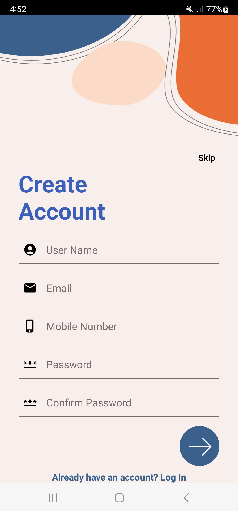
  
  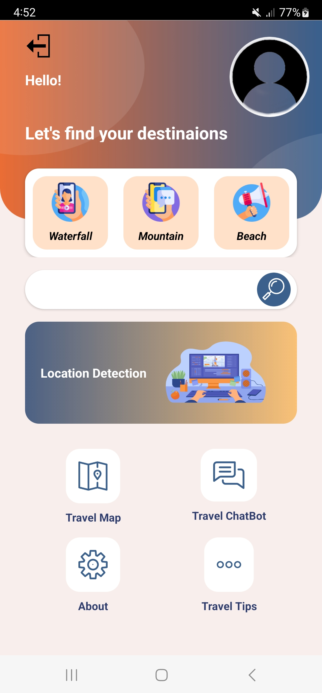
  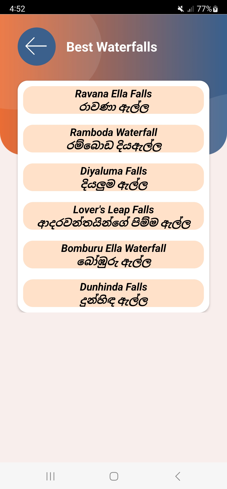
  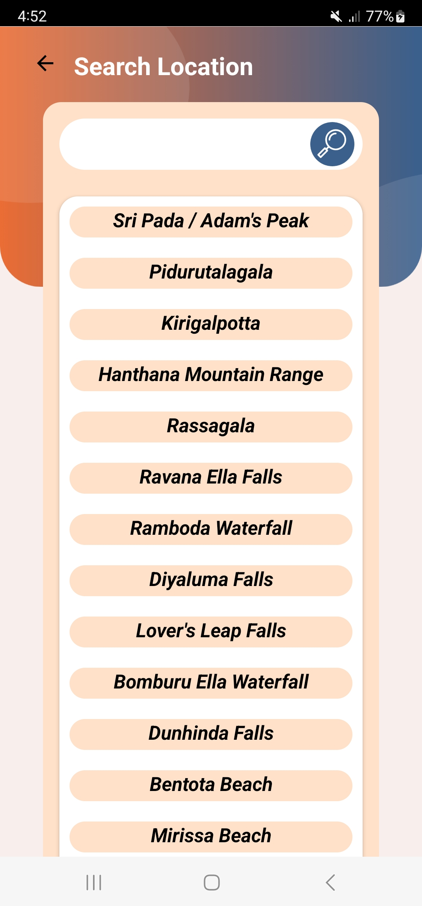
  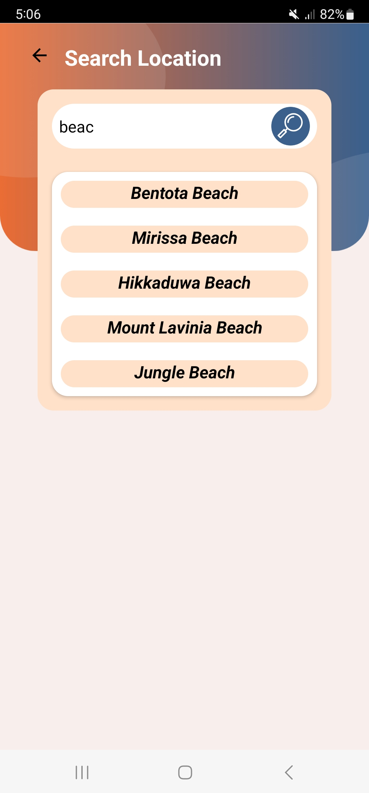
  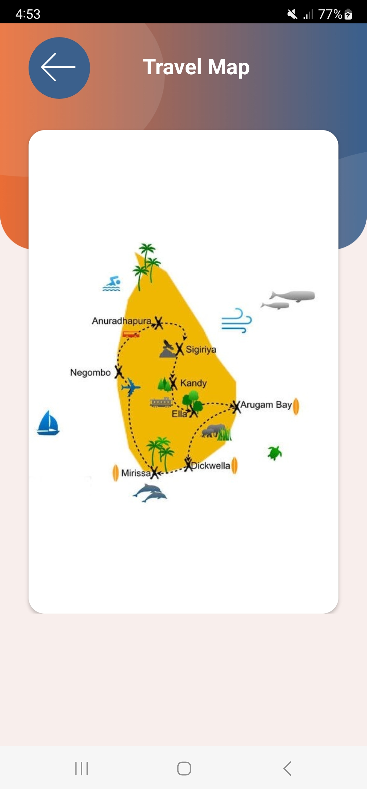
  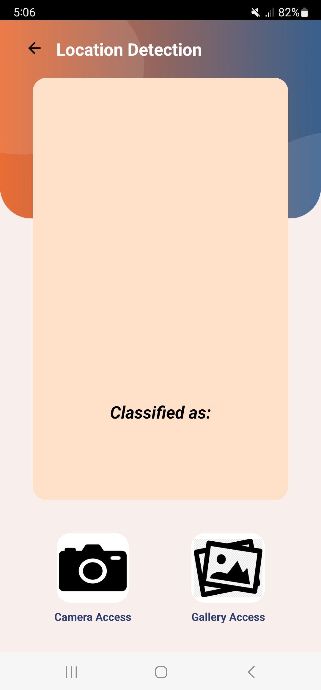
  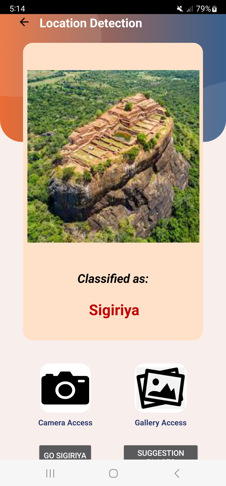
  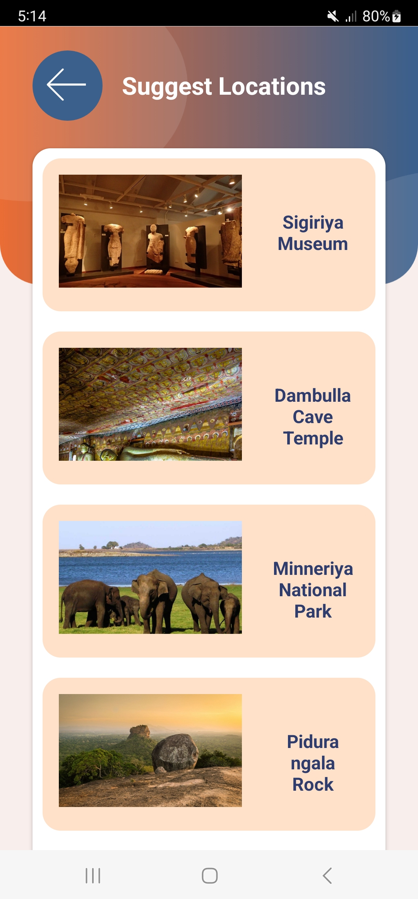
  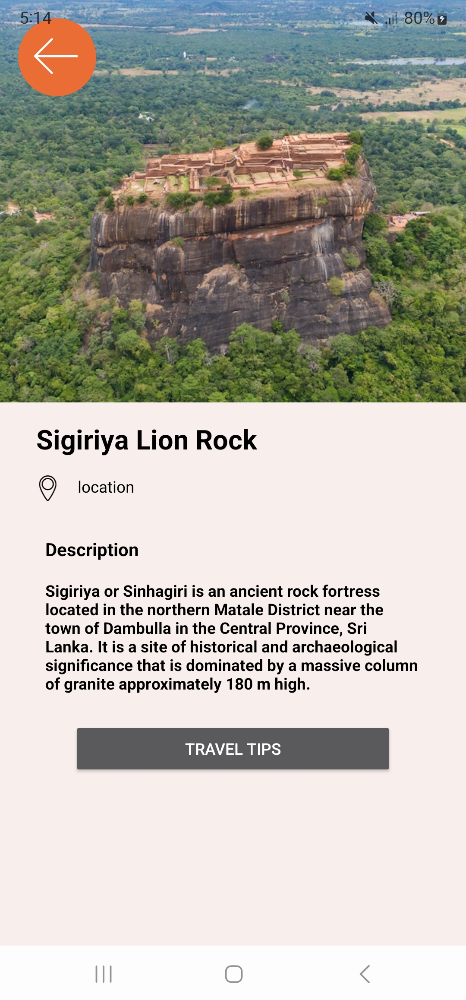
  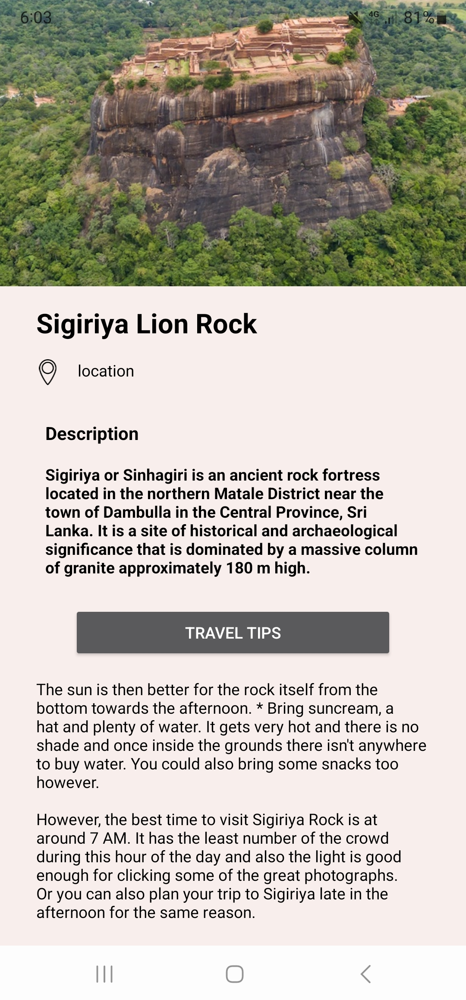
  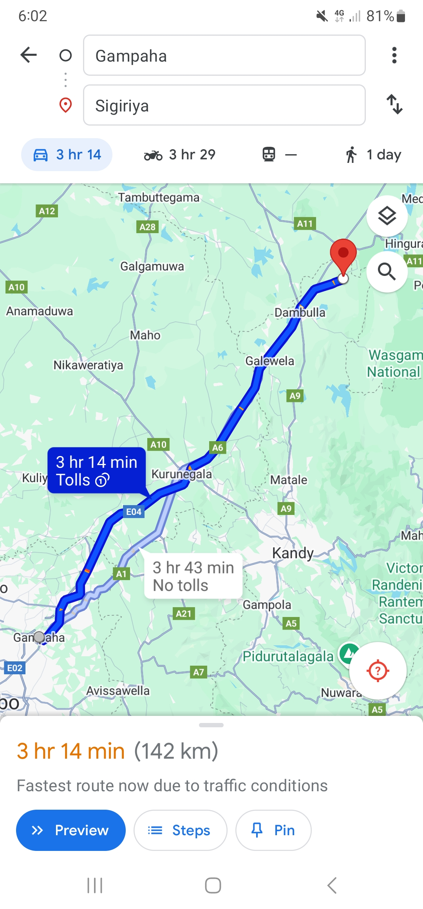
  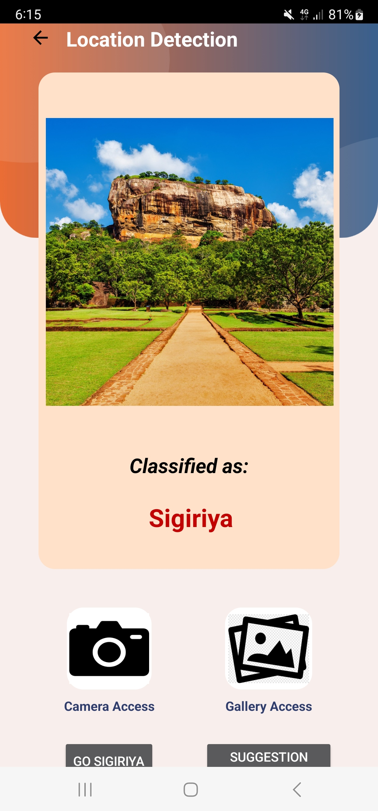
  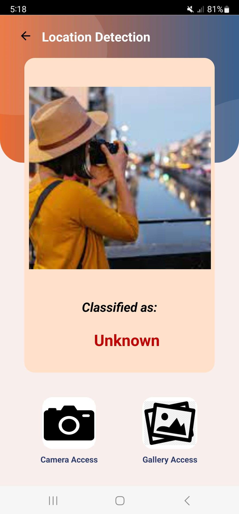
  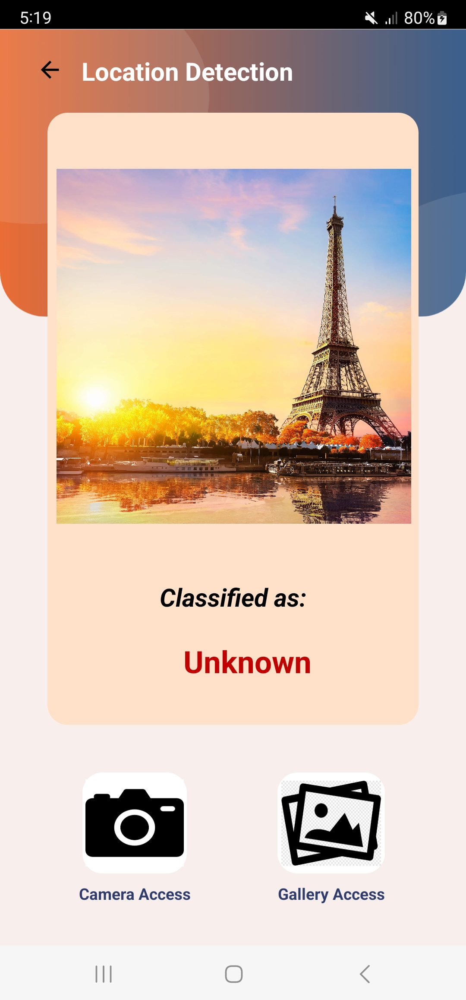
  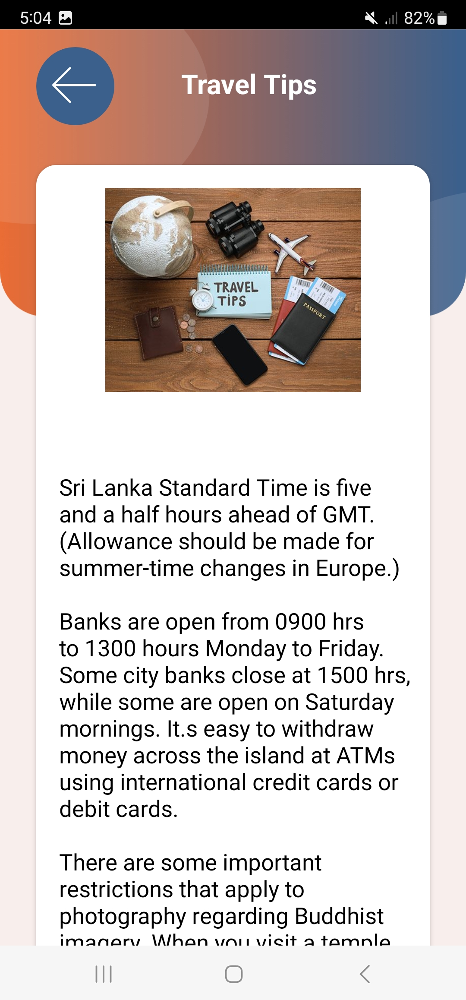
  

## Features

- **User-Friendly Interface**: Intuitive navigation through various sections, including beaches, mountains, waterfalls, and travel tips.
- **Image Upload & Detection**: Users can upload images to the detection model, which accurately identifies and suggests locations based on the content of the images.
- **Location Suggestions**: The app provides recommendations for nearby attractions, enhancing the travel experience.
- **Dynamic Content**: The app includes a variety of content, such as descriptions, images, and additional information about each location.

## Architecture

The application is structured into various activities, each representing a different section of the travel experience:

- **Image Detection**: Integrates TensorFlow Lite for image detection capabilities, allowing users to upload images and receive location-based suggestions.
- **MainActivity**: The entry point of the application, guiding users to different features.
- **Beach Activities**: Dedicated activities for each beach location with descriptions and images.
- **Mountain Activities**: Sections for different mountains, complete with user-friendly layouts and informative content.
- **Waterfall Activities**: Provides insights into popular waterfalls with rich media.
- **Suggest Activities**: Suggests locations based on user interactions and preferences.

## Technologies Used

- **Android SDK**: The primary software development kit used for building the Android application.
- **Java**: The main programming language employed for developing the application logic and functionalities.
- **XML**: Used for designing user interface layouts, ensuring a visually appealing and user-friendly experience.
- **TensorFlow Lite**: A lightweight machine learning framework integrated for real-time image detection and location identification based on user-uploaded images.
- **Database**: SQLite (for local data storage).
- **Gradle**: The build automation tool used for managing dependencies and building the application.
- **Android Studio**: The integrated development environment (IDE) utilized for coding, debugging, and testing the application.

## Getting Started

### Prerequisites

- Android Studio
- Android SDK
- TensorFlow Lite library

## Installation and Run

To run this project locally:
1. Clone the repository from GitHub.
2. Open the project in Android Studio.
3. Ensure that all dependencies are installed and configured correctly in the build.gradle file.
4. Run the application on an Android device or emulator.

## Usage

1. Launch the application and navigate through the main menu.
2. Explore different sections to view beaches, mountains, and waterfalls.
3. Use the image upload feature to test the detection model. The application will analyze the uploaded image and suggest relevant locations based on its content.

## Future Improvements

While the application currently offers a variety of features, there are numerous opportunities for enhancements:

- **Enhanced Image Detection**: Improve the detection model's accuracy by training it with a larger dataset and refining the algorithms used.
- **User Profiles**: Introduce user authentication and profile management, allowing users to save their favorite locations and activity history.
- **Offline Functionality**: Implement offline access to certain features, such as saved locations or previously loaded content.
- **Multi-language Support**: Expand the app's accessibility by adding support for multiple languages.
- **User Feedback System**: Integrate a feedback mechanism for users to share their experiences and suggestions, enhancing user engagement.
- **Social Media Integration**: Allow users to share their travel experiences directly from the app to various social media platforms.

